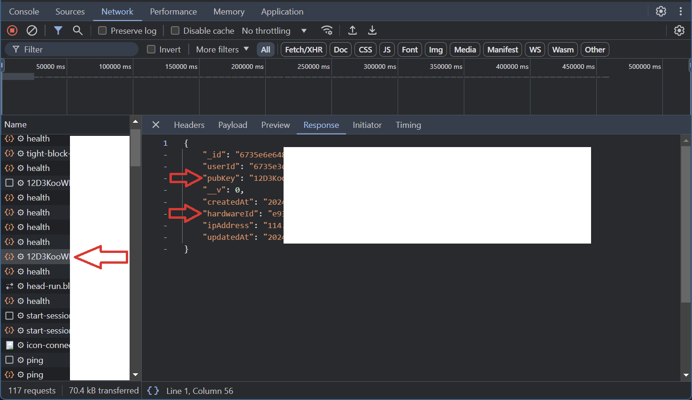

# Bless BOT
Bless BOT

- Register Here : [Bless](https://bless.network/dashboard?ref=BPSZ9G)
- Use Code: BPSZ9G

## Features

  - Auto Get Account Information
  - Auto Run With [Monosans](https://raw.githubusercontent.com/monosans/proxy-list/main/proxies/all.txt) Proxy - Choose 1
  - Auto Run With Private Proxy - Choose 2
  - Auto Run Without Proxy - Choose 3
  - Auto Send Ping Every 10 Minutes
  - Multi Accounts & Multi Node With Threads

## Requiremnets

- Make sure you have Python3.9 or higher installed and pip.

## Instalation

1. **Clone The Repositories:**
   ```bash
   git clone https://github.com/vonssy/Bless-BOT.git
   ```
   ```bash
   cd Bless-BOT
   ```

2. **Install Requirements:**
   ```bash
   pip install -r requirements.txt #or pip3 install -r requirements.txt
   ```

## Configuration

### Screenshots

<div style="text-align: center;">
  <h4><strong>PubKey & HardwareId</strong></h4>
  
</div>

- **accounts.json:** You will find the file `accounts.json` inside the project directory. Make sure `accounts.json` contains data that matches the format expected by the script. Here are examples of file formats:
  ```bash
  [
      {
          "Token": "Your Bearer Token 1",
          "Nodes": [
              {
                  "PubKey": "Your PubKey 1",
                  "HardwareId": "Your HardwareId 1"
              },
              {
                  "PubKey": "Your PubKey 2",
                  "HardwareId": "Your HardwareId 2"
              },
              {
                  "PubKey": "Your PubKey 3",
                  "HardwareId": "Your HardwareId 3"
              },
              {
                  "PubKey": "Your PubKey 4",
                  "HardwareId": "Your HardwareId 4"
              },
              {
                  "PubKey": "Your PubKey 5",
                  "HardwareId": "Your HardwareId 5"
              }
          ]
      },
      {
          "Token": "Your Bearer Token 2",
          "Nodes": [
              {
                  "PubKey": "Your PubKey 1",
                  "HardwareId": "Your HardwareId 1"
              },
              {
                  "PubKey": "Your PubKey 2",
                  "HardwareId": "Your HardwareId 2"
              },
              {
                  "PubKey": "Your PubKey 3",
                  "HardwareId": "Your HardwareId 3"
              },
              {
                  "PubKey": "Your PubKey 4",
                  "HardwareId": "Your HardwareId 4"
              },
              {
                  "PubKey": "Your PubKey 5",
                  "HardwareId": "Your HardwareId 5"
              }
          ]
      }
  ]
  ```

- **proxy.txt:** You will find the file `proxy.txt` inside the project directory. Make sure `proxy.txt` contains data that matches the format expected by the script. Here are examples of file formats:
  ```bash
    ip:port # Default Protcol HTTP.
    protocol://ip:port
    protocol://user:pass@ip:port
  ```

## Run

```bash
python bot.py #or python3 bot.py
```

## Buy Me a Coffee

- **EVM:** 0xe3c9ef9a39e9eb0582e5b147026cae524338521a
- **TON:** UQBEFv58DC4FUrGqinBB5PAQS7TzXSm5c1Fn6nkiet8kmehB
- **SOL:** E1xkaJYmAFEj28NPHKhjbf7GcvfdjKdvXju8d8AeSunf
- **SUI:** 0xa03726ecbbe00b31df6a61d7a59d02a7eedc39fe269532ceab97852a04cf3347

Thank you for visiting this repository, don't forget to contribute in the form of follows and stars.
If you have questions, find an issue, or have suggestions for improvement, feel free to contact me or open an *issue* in this GitHub repository.

**vonssy**